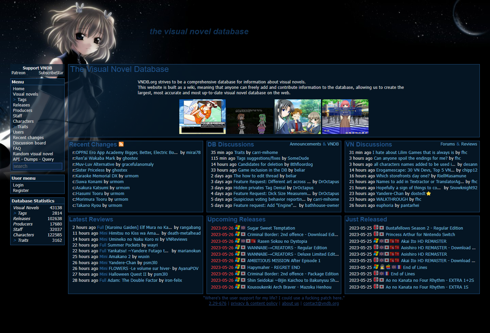
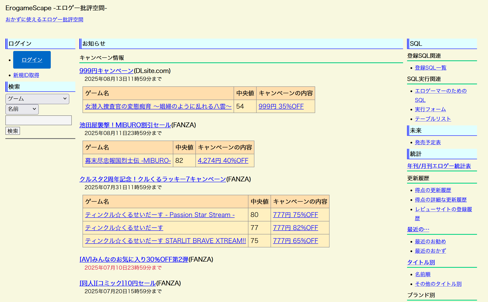

# 📚 Where to Find VNs

Useful sources for discovering new titles and keeping track of what you’ve read.

---

## [VNDB](https://vndb.org/)

{ width=600 }

A massive, community-maintained encyclopedia of VNs. If you aren't on here, what are you doing?

**Features:**

- Detailed release history  
- Tags, ratings, and screenshots  
- User lists and advanced filters (great for creating your infinite backlog)

---

## [ErogameScape](https://erogamescape.dyndns.org/~ap2/ero/toukei_kaiseki/)

{ width=600 }

Japanese database for eroge and visual novels. Mostly useful for when you want to know what the native audience thinks about a certain game.

**Features:**

- Median play time and player rankings  
- Character popularity ratings  
- Voting trends and historical data  
- おかず得点...

---

Looking for actual download sources? Check the [sources](sources.md) page.
