# Learning Japanese with Visual Novels

*Your complete beginner's guide to reading Japanese VNs and games*
{ align=center }

---

## Why Visual Novels Are Perfect for Learning Japanese

Visual novels offer a number of unique advantages for Japanese learners that traditional textbooks simply can't match:

- **Extensive reading practice** - VNs contain thousands of lines of dialogue and narration
- **Native audio** - Many VNs are fully voice-acted by professional Japanese voice actors
- **Visual context** - Images and scenes help you understand situations and context
- **Engaging content** - You're learning through stories you actually want to follow
- **Interactive learning** - Choices and alternate routes keep you actively engaged

Unlike textbooks (which are often unnatural and lack real context), VNs let you **read at your own pace** while experiencing **real Japanese** in natural contexts.

---

## Understanding Japanese Writing

Before getting started, it's helpful to understand what you'll be reading. Japanese uses three writing systems that work together:

**Hiragana and Katakana (Kana)**

These are the two phonetic scripts, each containing about 46 basic characters. They represent the same sounds but have different uses:

- **Hiragana** - Primarily used for grammar particles, parts of words of Japanese origin, and native Japanese words
- **Katakana** - Used primarily for foreign loanwords (like コーヒー for "coffee"), slang, onomatopoeia, and emphasis

As phonetic scripts, once you learn them, you can read any kana text out loud, even if you don't understand the meaning.

**Kanji (Chinese Characters)**

These are logographic characters adopted from Chinese. Japanese uses about 2,000-3,000 common kanji in everyday writing.

- **Why kanji matters:** Most content words (nouns, verbs, adjectives) are written using kanji. Unless you only plan on playing full-kana children's games, you need to learn them
- **Multiple readings:** Each kanji can have different pronunciations depending on the context

**How they work together:**

A typical Japanese sentence mixes both kana and kanji. This might seem complex, but it's actually efficient once you get used to it.

### Hiragana Chart

| | a | i | u | e | o |
|---|---|---|---|---|---|
| **∅** | あ a | い i | う u | え e | お o |
| **K** | か ka | き ki | く ku | け ke | こ ko |
| **S** | さ sa | し shi | す su | せ se | そ so |
| **T** | た ta | ち chi | つ tsu | て te | と to |
| **N** | な na | に ni | ぬ nu | ね ne | の no |
| **H** | は ha | ひ hi | ふ fu | へ he | ほ ho |
| **M** | ま ma | み mi | む mu | め me | も mo |
| **Y** | や ya | | ゆ yu | | よ yo |
| **R** | ら ra | り ri | る ru | れ re | ろ ro |
| **W** | わ wa | | | | を wo* |
| **N** | ん n | | | | |

### Katakana Chart

| | a | i | u | e | o |
|---|---|---|---|---|---|
| **∅** | ア a | イ i | ウ u | エ e | オ o |
| **K** | カ ka | キ ki | ク ku | ケ ke | コ ko |
| **S** | サ sa | シ shi | ス su | セ se | ソ so |
| **T** | タ ta | チ chi | ツ tsu | テ te | ト to |
| **N** | ナ na | ニ ni | ヌ nu | ネ ne | ノ no |
| **H** | ハ ha | ヒ hi | フ fu | ヘ he | ホ ho |
| **M** | マ ma | ミ mi | ム mu | メ me | モ mo |
| **Y** | ヤ ya | | ユ yu | | ヨ yo |
| **R** | ラ ra | リ ri | ル ru | レ re | ロ ro |
| **W** | ワ wa | | | | ヲ wo* |
| **N** | ン n | | | | |

**Notes:** *は = "wa" as particle, を = "o" as particle. Dakuten (゛) and handakuten (゜) modify sounds.

---

## The Learning Path Overview

```mermaid
flowchart LR
    subgraph S1 ["Foundation (1wk)"]
        A["🔤 Learn Kana"] --> B["📚 Kaishi"] --> C["📝 Basic Grammar"]
    end
    
    subgraph S2 ["Active Learning (1-6mo)"]
        D["🛠️ Setup Tools"] --> E["📖 Pick VN"] --> F["🎮 Read"] --> G["⛏️ Mine"] --> H["🔄 Build a Routine"]
    end
    
    subgraph S3 ["Mastery (6+mo)"]
        I["🎯 Read More"] --> J["🚀 出来る"]
    end
    
    S1 --> S2
    S2 --> S3
    
    style S1 fill:#e3f2fd
    style S2 fill:#e8f5e8
    style S3 fill:#fff3e0
```

!!! info "The Right Mindset"
    Here's the truth: **you don't study until you can read VNs, you study WITH them**. The moment you know kana and some basic grammar, you should be attempting to read. Yes, it will be overwhelming at first, but that's how you actually learn.
    
    If you've made the decision to learn Japanese, the best thing you can do is tell yourself that if you want to enjoy Japanese media, it must be in the original language. This separates people who make it from those who don't.

### The Immersion-First Approach

Forget the traditional "build foundations first" approach. That's a trap that keeps you in textbooks forever. Instead, embrace the chaos of jumping in early. You'll be confused, you'll look up tons of words, and that's exactly what should happen.

Think of it this way: when children learn their native language, they don't spend years studying grammar before attempting to understand stories. They're thrown into the language from day one, picking up patterns through exposure. The same principle applies here.

At the beginning, it may seem impossible, and the results of your efforts may not immediately be apparent. However, if you trust the process and make a serious effort to understand all Japanese text that you interact with, you will improve. If you instead keep telling yourself that you "need" translations, and that you're still "not ready" for real native content, you won't.

**Your actual timeline:** Learn kana (1 week maximum), start the [Kaishi 1.5k](https://ankiweb.net/shared/info/1196762551) Anki deck, set up tools, and immediately start engaging with native content. Don't wait for some arbitrary "readiness" milestone that doesn't exist.

---

## Step 1: Master the Basics

### Learn Hiragana and Katakana (1 week maximum)

Kana is your gateway to everything Japanese, but don't overthink it. This should take a few days to a week at most, not weeks of perfectionist drilling.

The fastest approach is intense but effective: Immediately start practicing with the [interactive kana game](https://vedxyz.github.io/kana/). Don't aim for 100% accuracy before moving on-you'll naturally improve through exposure to real Japanese text.

Here's the key insight: you'll learn kana faster by seeing it in context (like in actual VNs) than by endlessly drilling isolated characters. Once you can recognize most kana even if slowly, you're ready to start reading. Speed and accuracy will come naturally through practice.

**The perfectionist trap:** Many learners spend weeks "mastering" kana before touching real content. This is backwards. Get comfortable with the basics, then let real reading solidify your knowledge.

### Start Building Vocabulary (Ongoing from Day 1)

Vocabulary learning should begin immediately and run parallel to your reading, not before it. The [Kaishi 1.5k deck](https://ankiweb.net/shared/info/1196762551) is specifically designed for this approach. It's the most beginner-friendly option available, and makes use of relevant example sentences.

Start conservatively with 10-15 new cards daily. As you begin reading VNs, you'll discover which words appear frequently in your chosen content. This creates a powerful feedback loop: Anki introduces you to common words, and your reading reinforces them in context.

The great thing about starting to learn vocabulary alongside reading is that you'll immediately see Anki words appearing in your VNs. That moment of recognition when you come across a word that you have just learned is incredibly motivating and helps cement the vocabulary in your long-term memory.

**Alternative option:** [Core 2k/6k Deck](https://ankiweb.net/shared/info/1237389412) covers the most common Japanese words, but Kaishi's beginner focus makes it more suitable for VN readers.

!!! note "Why Skip Isolated Kanji Study?"
    It is recommended to start learning vocabulary directly rather than studying individual kanji in isolation (like RTK or KKLC). Learning words with kanji in context is more practical and immediately useful for reading. If Kaishi feels too difficult, consider the [RRTK450 deck](https://mega.nz/file/2SJiWC4b#hL98qtC_hiLlQDg0LqVJoqD2-5ywT2Nwd4kjROY_KwQ) as a bridge, but you don't need to spend months on isolated kanji study before starting real content.

### Essential Grammar Foundation (Ongoing)

**Primary recommendation:**

- **[Tae Kim's Grammar Guide](http://www.guidetojapanese.org/learn/)** - Free, comprehensive, and practical. Tae Kim isn't perfect, but it's a quick read, which is why it's recommended. Start here for solid fundamentals.

**For deeper understanding:**

- **[IMABI](https://imabi.org/)** - Incredibly detailed grammar explanations covering everything from beginner to advanced topics. IMABI is more accurate than Tae Kim but may be overwhelming for some. Use this when you need thorough explanations of complex grammar points you encounter in VNs.

**Alternative approaches:**

- **[Bunpro](https://bunpro.jp/)** - SRS-based grammar learning with built-in reviews
- **[Cure Dolly YouTube Series](https://www.youtube.com/playlist?list=PLg9uYxuZf8x_A-vcqqyOFZu06WlhnypWj)** - Explains grammar from Japanese perspective
- **[Sakubi](https://sakubi.neocities.org/)** - Structured grammar course with examples

Remember: you will learn more grammar through actually making an effort to understand sentences in the wild than through any grammar guide.

**Study approach:** 

- Keep reading grammar points while learning vocab
- Focus on understanding and recognizing patterns rather than rules
- Always try to understand grammar in context
- Don't aim for perfection, understanding develops through exposure

---

## Step 2: Set Up Your Reading Tools (Do This Immediately)

Don't delay tool setup because you'll need these from your very first reading session. The goal is to remove every possible barrier between you and Japanese text.

### Essential Software Setup

You'll need three core tools to start reading VNs effectively. Install them in this order for the smoothest experience.

#### 1. Anki - Your Vocabulary Foundation

!!! tip "Core Learning Tool"
    While you can get really good at reading Japanese without Anki through interacting with native text, this spaced repetition system is a very powerful tool for retaining vocabulary you encounter in your reading.

**What it does:** Ensures you actually remember vocabulary long-term through scientifically-optimized review scheduling.

**Setup:** Follow [Donkuri's detailed Anki setup guide](https://donkuri.github.io/learn-japanese/setup/#anki-setup) for complete installation and configuration.

---

#### 2. Dictionary Tool - Choose Your Lookup Method

Choose between JL (recommended for VN readers) or Yomitan (browser-based alternative):

!!! success "JL - Recommended for VN Readers"
    **Best choice for most learners**
    
    JL is specifically designed for Japanese learners reading visual novels. It offers the most streamlined experience for VN workflows.

    **Why choose JL:**
    
    - Built specifically for VN readers and learners
    - Works system-wide (no browser required)
    - Integrated Anki mining features
    - Reading statistics and progress tracking

    **Setup:** Follow [our JL guide](jl-guide.md) for complete installation and configuration.

!!! note "Yomitan - Browser-Based Alternative"
    **Choose this if you prefer browser-based tools**
    
    Select Yomitan if you prefer browser-based reading or need to look up text on websites frequently.

    **When to use Yomitan:**
    
    - You prefer reading VNs in browser
    - You frequently look up text on Japanese websites
    - You want a more traditional dictionary extension experience

    **Setup:** Follow [Donkuri's Yomitan setup guide](https://donkuri.github.io/learn-japanese/setup/#yomitan-setup) for complete installation and configuration.

---

#### 3. Text Hooker - Your Text Extraction Engine

!!! info "Text Hooking"
    Textractor extracts text from VNs so you can copy, look up, and mine vocabulary without manually typing Japanese characters.

**What it does:** Hooks into VN processes and extracts displayed text in real-time for easy dictionary lookups.

**Setup:** Follow [our complete Textractor guide](textractor-guide.md) for installation and configuration.

**Key features:** Compatible with most VNs, supports extensions, WebSocket integration for browser dictionaries

!!! warning "Setup Priority"
    Install tools in order: **Anki → Dictionary Tool → Text Hooker**. Each tool builds on the previous one for optimal workflow integration.

---

### The Holy Trinity of Japanese Learning

!!! success "The Three Essential Tools"
    

    
    **📚 SRS** ←→ **📖 Dictionary** ←→ **🔗 Text Hooker**
    
    *Anki* ↔ *JL / Yomitan* ↔ *Textractor / OCR*
    
    

These three tools work together to create a powerful Japanese learning ecosystem: your text hooker extracts text from VNs, your dictionary looks up and mines vocabulary, and Anki ensures long-term retention. Each tool supports each other in a continuous learning cycle.

---

## Step 3: Jump Into Your First Visual Novel

### Choosing Content for Maximum Learning

It may be a good idea to pick something you're genuinely interested in reading, even if it seems challenging. If it feels like too much for you to handle, you can always put it on hold and come back to it later. Passion for the story will carry you through moments of confusion better than "optimal" difficulty ever could.

Remember: you're committing to experiencing this story in Japanese, not just "trying" Japanese. This mindset shift is crucial. You're not using Japanese as practice for some future enjoyment; you're enjoying the medium through Japanese from day one.

That said, certain features make the learning process smoother. Furigana support (hiragana readings above kanji) is helpful for beginners. Modern, everyday language transfers better to other content than historical or fantasy vocabulary. Voice acting provides pronunciation models and helps with listening comprehension.

Length is a psychological factor: finishing a shorter VN makes reading in Japanese feel achievable and builds confidence for longer works. But don't let length deter you from a story you really want to read. Better to struggle through something engaging than breeze through something boring.

### Recommended First VNs

- **[Nanairo Reincarnation](https://vndb.org/v15473)** - Supernatural mystery with romance and comedy
- **[Tsuyuchiru Letter](https://vndb.org/v31212)** - Yuri romance set in a prestigious girls' school
- **[Gyakuten Saiban (Ace Attorney)](https://vndb.org/v711)** - Also known as Ace Attorney in the west. The famous legal mystery series with engaging courtroom drama
- **[Marco to Ginga Ryuu](https://vndb.org/v26902)** - Extremely engaging, but short visual novel with tons of CGs
- **[9-nine- Series](https://vndb.org/v19829)** - Supernatural life-and-death drama. Starts out slow, but gets better towards the end
- **[Totono](https://vndb.org/v7738)** - Psychological romance involving a dramatic love triangle
- **[Famicom Detective Club](https://vndb.org/v3433)** - Classic murder mystery series. Available on the Switch and practically fully voiced
- **[Summer Pockets](https://vndb.org/v20424)** - Island summer story by Key. Long, but lots of slice of life content
- **[Clannad](https://vndb.org/v4)** - The classic Key drama
- **[Kanon](https://vndb.org/v33)** - The other classic Key drama
- **[Aokana](https://vndb.org/v12849)** - Sports drama in a world with anti-gravity flying

#### **Free Options for Practice**
- **Browse [NovelGame.jp](https://novelgame.jp/)** - Many free short VNs for practice
- **Check [Freem!](https://www.freem.ne.jp/)** - Free games including visual novels
- **Try web-based VNs** - No installation required, good for testing setup

---

## Step 4: Reading Strategy and Building Sustainable Habits

### The Core Philosophy: Serious Engagement from Day One

Remember your commitment: if you want to enjoy Japanese media, it must be in the original language. This isn't about casual exposure or "trying" Japanese; it's about making a serious effort to understand all Japanese you interact with. You don't need to go "AJATT" or block out other languages, but you do need genuine engagement with the language. Resist the urge to reach for translations when things get difficult.

### Daily Reading Strategy

**Start Your Reading Sessions Right**

Approach each VN session with the mindset that you're experiencing a story in Japanese, not studying Japanese through a story. Have your tools ready, but don't let technical setup distract from the core activity: reading and understanding.

**The Smart Lookup Strategy**

- **Look up words you see frequently** - these give you the highest learning value
- **Look up key story elements** - names, important concepts, anything crucial to your understanding of the story
- **Don't assume that you know the meaning of words** - your intuition as a non-native speaker is not going to be perfect

**The Importance of Comprehensible Input**

Your goal is "comprehensible input": content that you can mostly understand with some effort. This means you should be genuinely trying to comprehend what you're reading, not just passively consuming text. Avoid "whitenoising" (mindlessly reading Japanese without caring about comprehension) as this provides no learning benefit and can actually be counterproductive.

The sweet spot is content where you understand enough to follow the story but encounter enough unknown elements to learn from. If you understand almost nothing, the content may be too difficult. If you understand everything easily, you're not being challenged enough to grow.

Don't get caught up in quantification and metrics. Some people get discouraged when they see low character counts or didn't read as much as they wanted that day, but these numbers don't define your progress. What truly matters is showing up consistently and making a serious effort to understand. Your comprehension and reading speed will naturally improve through regular exposure. Trust the process rather than obsessing over daily statistics.

### Building Vocabulary Through Mining

**What is mining?**

Mining is the process of finding vocabulary in the wild (while reading VNs, playing games, etc.) and adding that vocabulary to a custom Anki deck for long-term retention.

As you read, you'll naturally encounter words worth learning. Mining vocabulary from your VNs creates personalized learning that's directly relevant to your interests.

Remember: **Anki is designed for memory, not learning**. You want to mine words that are about 75% of the way there: words that seem useful and can actually be remembered after a couple exposures. The goal is finding that sweet spot between learnable, useful, and not super uncommon.

**Smart Mining Strategy:**

1. **Encounter unknown word** during reading
2. **Look up the word** using JL or Yomitan's integrated lookup
3. **Ask yourself**: Is this word learnable, useful, and frequent enough?
4. **Mine only if it passes the "75% test"** - you can grasp it and it seems worth remembering
5. **Create Anki card** with the sentence context from your VN

**The "75% Test" - Mine words that are:**

- **Learnable** - You can understand and remember them after a few exposures
- **Useful** - They appear frequently or are crucial to story understanding
- **Not too obscure** - Common enough that you'll see them again in other content
- **Feel "graspable"** - Something clicks when you look them up

**What NOT to Mine (Especially as a Beginner):**

- Words that feel completely overwhelming or abstract
- Extremely rare or archaic terms you'll never see again
- Technical jargon unrelated to your interests
- Words you consistently understand from context

**Advanced Note:** Once you reach higher levels, you can mine anything you don't know since your foundation is solid. But early on, be selective and focus on building that strong core vocabulary.

**For detailed mining setup:** Check out [Donkuri's comprehensive mining guide](https://donkuri.github.io/learn-japanese/mining/) for advanced mining workflows, note types, and technical setup guides. If you're using JL (our recommended dictionary), see our [JL Anki integration guide](jl-guide.md#enabling-anki-integration) for streamlined VN mining.

### Building Daily Consistency

The most important thing is showing up every day. When and how long you study matters less than never missing a day.

**Daily Reading: Your Primary Learning Activity**

Read your VN every day, even if just for 15-30 minutes. This is your main learning time, not a reward for completing other studies. Some days you'll read for 30 minutes, others for two hours. Let your energy and interest guide the session length, but try not to skip it entirely.

**Daily Anki: Non-Negotiable**

Anki is designed around daily completion and becomes significantly less effective if you miss days. The spaced repetition algorithm depends on consistent daily reviews to work properly. For the best results, complete your Anki reviews every single day: consistency beats intensity.

If your daily load becomes overwhelming, lower your daily new card count or adjust your target retention percentage in FSRS settings, but never skip your reviews.

**Grammar: As-Needed Basis**

Learning to read Japanese is very similar to the mindset of a programmer: when there's something you don't understand, you look it up. Grammar study should happen when you encounter something confusing, not on a rigid schedule. You'll learn more grammar through making an effort to understand sentences in context than through isolated study.

**The Consistency Mindset**

Your daily engagement streak matters more than perfect sessions. Missing a day breaks the habit and makes it harder to restart. The goal is making Japanese interaction a daily habit, not achieving perfect study sessions.

### Recognizing Real Progress

**Early Victories (First Month)**

The first major milestone isn't comprehension, it's beginning to become comfortable with confusion. When you stop panicking about unknown words and start seeing reading sessions as entertainment rather than tests, you've made a crucial mental shift. This usually happens within the first few weeks of consistent reading.

Successfully setting up your workflow and extracting your first VN text feels technical, but it's actually a huge psychological win. You have made your first step towards Japanese literacy.

**Building Momentum (Months 2-6)**

Real progress becomes visible when you start recognizing vocabulary from Anki appearing in your VNs. This creates a positive feedback loop that accelerates learning. Another key milestone is reading for extended periods without mental fatigue; your brain is adapting to processing Japanese naturally.

Completing your first VN, regardless of comprehension level, represents a massive achievement. You've proven to yourself that it is possible for you to read in Japanese and that it is an enjoyable activity, not an impossible challenge.

**Long-term Development (6+ months)**

Eventually, reading shifts from being a mere part of your study routine to entertainment. You'll choose VNs based on interest rather than difficulty level. This transition from learning Japanese to learning through Japanese marks true immersion success.

Remember: these timelines are rough guides, not rigid requirements. Your progress depends on consistency and genuine engagement, not speed. Focus on building sustainable habits rather than hitting arbitrary milestones.

### Dealing with Challenges

**When you feel overwhelmed:**

- Take breaks as needed
- Review your Anki cards to reinforce known vocabulary
- Re-read previous sections for confidence
- Remember: confusion is part of the learning process
- **If your daily Anki load feels too heavy:** Lower your daily new card count or adjust your target retention percentage in FSRS settings, but try not to skip your reviews

**When progress feels slow:**

- Track your reading sessions to see consistency over time
- Notice vocabulary you now recognize that was once unknown
- Remember your commitment to experiencing Japanese media in its original language

**Remember:**

- **Every Japanese sentence you read** makes the next one easier
- **Progress isn't always visible**, so trust the process
- **Comparing yourself to others** is counterproductive
- **The journey is part of the reward**, so enjoy it as much as you can

!!! quote ""
    *"Read more." – Everyone who made it*

---

## Quick Start Checklist

Ready to begin? Here's your **immediate** action plan:

- [ ] **Day 1-3:** Learn kana basics with charts and the [kana game](https://vedxyz.github.io/kana/)
- [ ] **Day 4-5:** Install and configure JL (or Yomitan) + Textractor
- [ ] **Day 6-7:** Download Kaishi deck, start Anki, choose your first VN
- [ ] **Week 2:** Begin reading your chosen VN daily (even if it's confusing at first)
- [ ] **Week 3+:** Develop consistent daily routine of Anki + VN reading
- [ ] **Month 1+:** Start mining vocabulary from your VNs as you encounter interesting words

**The key insight:** You're not preparing to learn Japanese, you're learning it from day one. Every day you delay reading is a day of lost progress.

**Most important:** Embrace the chaos of jumping in early. You'll be confused, overwhelmed, and frequently lost, and that's exactly how language learning works. Start today, stay consistent, and trust that understanding comes through exposure, not preparation. But don't worry, you will make it! 

---

## Influential Japanese Learning Guides

This guide draws inspiration from several excellent resources in the Japanese learning community. If you want to explore different perspectives on immersion-based learning, check out these guides that have influenced my learning philosophy:

- **[Donkuri's Learn Japanese Guide](https://donkuri.github.io/learn-japanese/)**
- **[TheMoeWay Japanese Guide](https://learnjapanese.moe/)**  
- **[Animecards Site](https://animecards.site/)**
- **[All Japanese All The Time (AJATT)](https://alljapanesealltheti.me/index.html)**

While this guide focuses specifically on visual novels and games, these guides provide complementary perspectives.

---

## Community and Support

Want to connect with other learners? **[Join our Discord](join.md)** for questions, progress sharing, and VN recommendations from the community.

*Ready to dive deeper? Check out our [Tools Page](tools.md) for more advanced setup options, or visit our [Sources](sources.md) page to find your first VN.*
