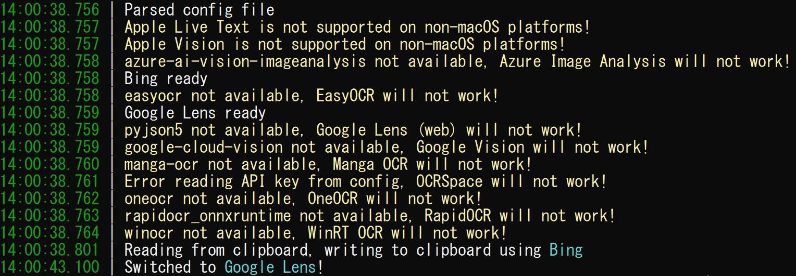
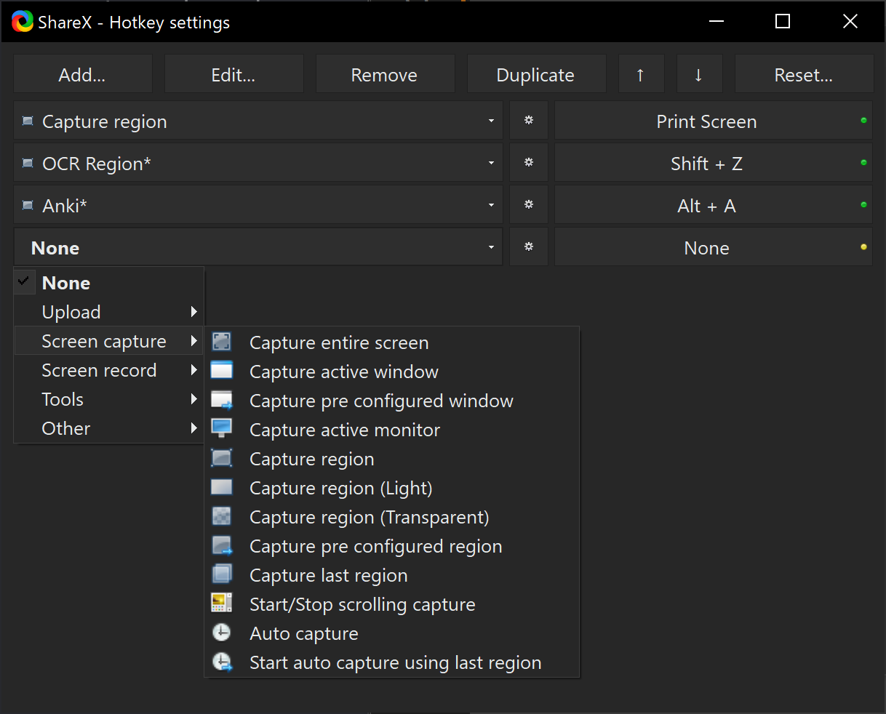
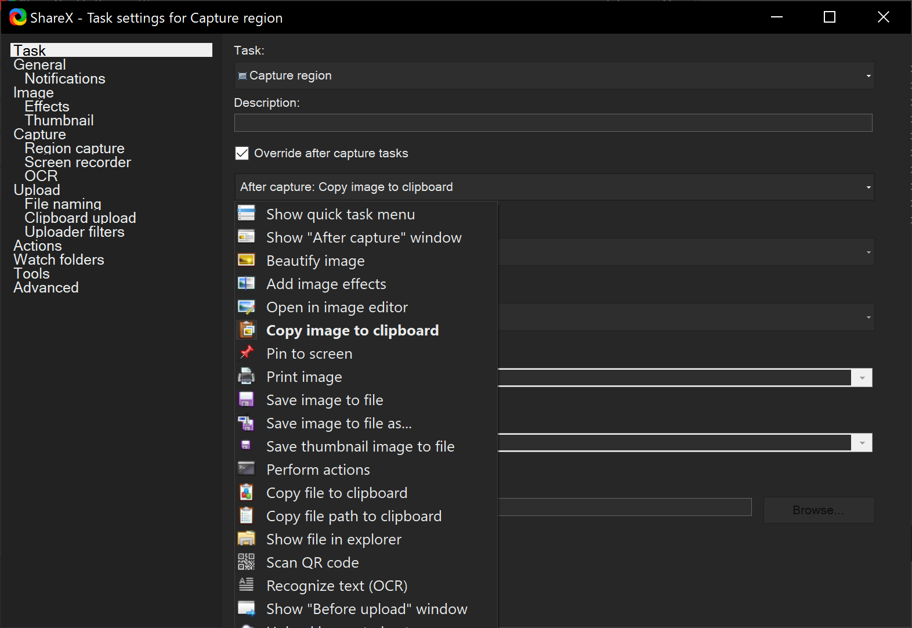
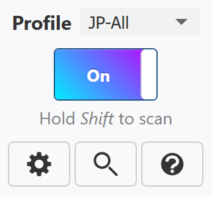

# OwOCR Guide

A simple guide on how to quickly set up and use [OwOCR](https://github.com/AuroraWright/owocr), an optical character recognition program that can make reading Japanese text from visual novels much easier.

> **Note:** This program uses a command line interface. If you're looking for something with a GUI, consider using [GameSentenceMiner](https://github.com/bpwhelan/GameSentenceMiner) which runs a fork of OwOCR.

---

## Prerequisites

Before you begin, you'll need to install the following:

- **[ShareX](https://getsharex.com/)** - Screenshot and screen capture tool
- **[Python](https://www.python.org/downloads/)** - Programming language runtime
> **Warning:** During Python installation, make sure to select "Add to Path". If you skip this step, OwOCR will not work.
- **OwOCR** - Install by running `pip install owocr` in your command prompt/terminal

---

## Basic Setup

### Installation

1. Install the prerequisites listed above
2. Open your command prompt/terminal
3. Run: `pip install owocr`

### First Run

Start OwOCR by running `owocr` in your command prompt. By default, the Bing provider should be available.



### Additional Providers

- **Google Lens:** Install with `pip install owocr[lens]` (most people are going to want to use this one)
- **Manga OCR:** Install with `pip install owocr[mangaocr]` (may be useful for vertical text)

---

## Usage

### Switching Providers

While OwOCR is running, you can switch between providers:

- Press **`l`** to switch to Google Lens
- Press **`m`** to activate Manga OCR

### How It Works

OwOCR automatically reads images from your clipboard and outputs the detected text back to your clipboard. Simply take a screenshot and the text will be processed automatically.

---

## Advanced Configuration

### Auto-Start with Google Lens

To automatically start with Google Lens, use:
```bash
owocr --engine=glens
```

### Auto-Restart Script

Create a batch file (`.bat`) with the following content for automatic restart on failure:

```batch
:Start
owocr --engine=glens
echo owocrが終了しました。再起動します…
TIMEOUT /T 1 /NOBREAK
GOTO Start
```

**Tip:** You can create a shortcut to this batch file for one-click launching.

---

## ShareX Configuration

To streamline the OCR process, configure ShareX to automatically copy screenshots to your clipboard:

### Setup Steps

1. **Open ShareX** or right-click the system tray icon and select "Hotkey settings"
2. **Remove unnecessary hotkeys** if desired
3. **Add a new hotkey** by clicking "Add"
4. **Select capture mode:**
    - **Capture Region** - Freezes screen while adjusting capture area
    - **Capture Region (Light)** - Lighter version without screen freeze
5. **Set your preferred hotkey** (avoid conflicts with game controls like Shift)
{: style="display: block; margin: 1.5em auto 2em auto; width: 500px;" }
6. **Configure the hotkey:**
    - Click the gear icon next to your hotkey
    - Under "Task" settings, enable "Override after capture tasks"
    - Select only "Copy image to clipboard"
    - Disable all other settings
{: style="display: block; margin: 1.5em auto 2em auto; width: 500px;" }

Now when you take a screenshot with this hotkey, it will only copy to clipboard for OwOCR to process.

---

## Integration Options

### JL
- **[JL](jl-guide.md)** — Hover dictionary program that can read from clipboard automatically. Perfect companion to OwOCR for seamless lookups.

**Pro tip:** You can position the JL window over a text box so that ShareX will automatically snap to that area if you hover over it. Just ensure that the "Text only visible on hover" setting is enabled.

**Quality of Life Settings:** JL has some useful options that make working with OCR tools easier:

- Preferences → Popup → Auto lookup the first term when it's copied from the clipboard
- Preferences → Popup → Auto lookup the first term when it's copied from a WebSocket
- Preferences → Popup → Don't auto look up the first term on text change if Main Window is not minimized

These settings allow looking up text without directly interacting with the textbox. OCRing the part you want to look up will automatically bring up the result popup.

### Yomitan Search Page
- Enable clipboard monitor in the extension
- Click the magnifying glass to access the search page
{: style="display: block; margin: 1.5em auto 2em auto; width: 200px;" }

### Browser Extensions
- **[Lap Clipboard Inserter (Firefox)](https://addons.mozilla.org/en-US/firefox/addon/lap-clipboard-inserter/)** – Reads clipboard text for use with text hooking pages
- **[Clipboard Inserter Redux (Chrome)](https://chromewebstore.google.com/detail/clipboard-inserter-redux/fhjjmocaopmmngdjmpgibphfchdmpbop)** – Chrome extension for clipboard text insertion on text hooker/search pages

### WebSocket Support
OwOCR supports reading images and writing text via WebSocket:

- Use `-r=websocket` to read images
- Use `-w=websocket` to write text
- Default port is 7331 (configurable in config file)

---

## Tips

- **Avoid hotkey conflicts:** Don't use keys that games commonly use (e.g., Shift for skip)
- **Consider mouse hotkeys:** If your mouse has extra buttons, try setting your screenshot hotkey to a side button or setting a macro to use your the key combination that you selected. This can be more convenient. (I personally use a side button for this.)
- **Test your setup:** Take a screenshot of Japanese text to verify OCR is working
- **Use appropriate providers:** Google Lens works best most of the time, but consider giving other providers a try

---
Additional information and detailed usage notes can be found on the OwOCRs's [github page](https://github.com/AuroraWright/owocr)