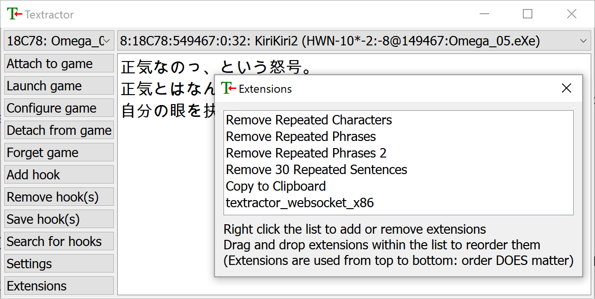
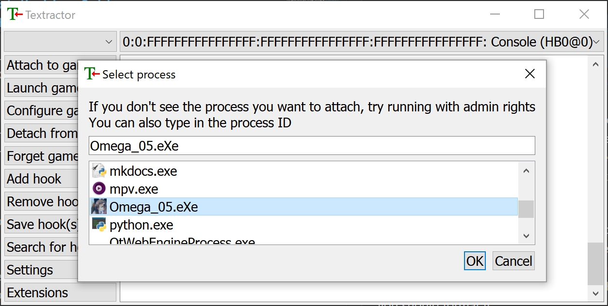
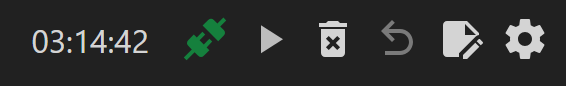

# Textractor Guide

This guide walks you through setting up **Textractor** and connecting it to a browser-based UI using the **WebSocket extension**. Ideal for reading and mining from Japanese visual novels using Yomitan in your browser.

---

## Requirements

- [Textractor (Chenx221's fork)](https://github.com/Chenx221/Textractor)
- [WebSocket Extension (kuroahna)](https://github.com/kuroahna/textractor_websocket)
- [Texthooker UI (Renji-XD)](https://renji-xd.github.io/texthooker-ui/)

---

## Step 1: Set Up Textractor

1. Download Textractor from [Chenx221's GitHub](https://github.com/Chenx221/Textractor). (On the releases tab, you will find a list of files that go texthook_xxxxxx.7z. Get the newest one listed as "Textractor (仅英语)")
2. Extract the `.zip` file.
3. You will see two folders: `x86` and `x64`. These correspond to 32-bit and 64-bit versions of Textractor.
    - Use `x86` for most games.
    - Use `x64` for modern visual novels that don't work with the x86 version.

---

## Step 2: Install the WebSocket Extension

Download the WebSocket extension from the [Releases page](https://github.com/kuroahna/textractor_websocket/releases) of the `kuroahna/textractor_websocket` repository.

### File Setup

1. Unzip the release package.
2. Copy `textractor_websocket_x86.dll` into your `Textractor/x86` folder.
3. Copy `textractor_websocket_x64.dll` into your `Textractor/x64` folder.

### Add Extensions to Textractor

#### For `x86`:

1. Open `Textractor/x86/Textractor.exe`
2. Click the **Extensions** button (left sidebar).
3. Right-click in the Extensions window → **Add Extension**
4. In the file picker:
   - Change the file type to `*.dll`
   - Select `textractor_websocket_x86.dll`

#### For `x64`:

1. Open `Textractor/x64/Textractor.exe`
2. Repeat the same steps above using `textractor_websocket_x64.dll`

> **Tip:** You can remove any unhelpful extensions (like extra new lines) from your Extensions list. My settings are provided below for reference.

<em>Textractor with the WebSocket extension loaded (Extensions window)</em>

---

## Step 3: Hook the Visual Novel

1. Launch your visual novel and get to a point where you can start loading text.
2. Open the matching version of **Textractor** (`x86` or `x64`) based on your game.
3. In Textractor, click "Attach to game" in the top-left to open the process list.
4. Select the visual novel’s process.

    > 🛠 If the game doesn’t appear in the list, try running Textractor as Administrator.

5. Advance the VN by a few lines to generate text for Textractor to capture.
6. Use the top dropdown in Textractor (where it says "Console") and press up and down to cycle through the hooks.
7. Find a hook that accurately reflects the game's text.

If textractor can't automatically find a working hook, you can try searching manually by selecting "Search for hooks" or checking the discussion tab of the game's VNDB page to see if anyone has listed a working hook code.

---

## Step 4: View Text in the Browser

1. Open [Renji-XD’s Texthooker UI](https://renji-xd.github.io/texthooker-ui/) in your browser. If the WebSocket is working, the colored icon in the top right should be green. If it's still red, trying clicking on it to reconnect.
2. Click the **Start** button in the top-right corner. (Or enable "Allow new Line during Pause" and "Autostart Timer by Line during Pause" in the settings.)
3. Once Textractor is hooked and sending text, the UI will display it in real time.
4. The WebSocket server will be automatically started by Textractor at:

    `ws://localhost:6677`

> This allows the texthooker UI to receive text directly from Textractor using the WebSocket extension.

{: style="display: block; margin: 1.5em auto 2em auto; width: 300px;" }

<em>This is what a successful WebSocket connection looks like (icon is green)</em>

---

## Additional Tips

- Keep both `x86` and `x64` folders ready — the version depends on the VN.
- Some games may not hook correctly if you set Textractor to automatically use a saved hook. Try restarting the game or clicking "Forget game".
- If you don’t see text in the UI, check that:
      - The WebSocket extension is installed correctly.
      - Textractor is actually hooked to the VN.
      - You're using a supported browser (Chrome, Firefox, Brave etc.).
      - Your firewall settings and browser extensions aren't blocking the WebSocket connection.
